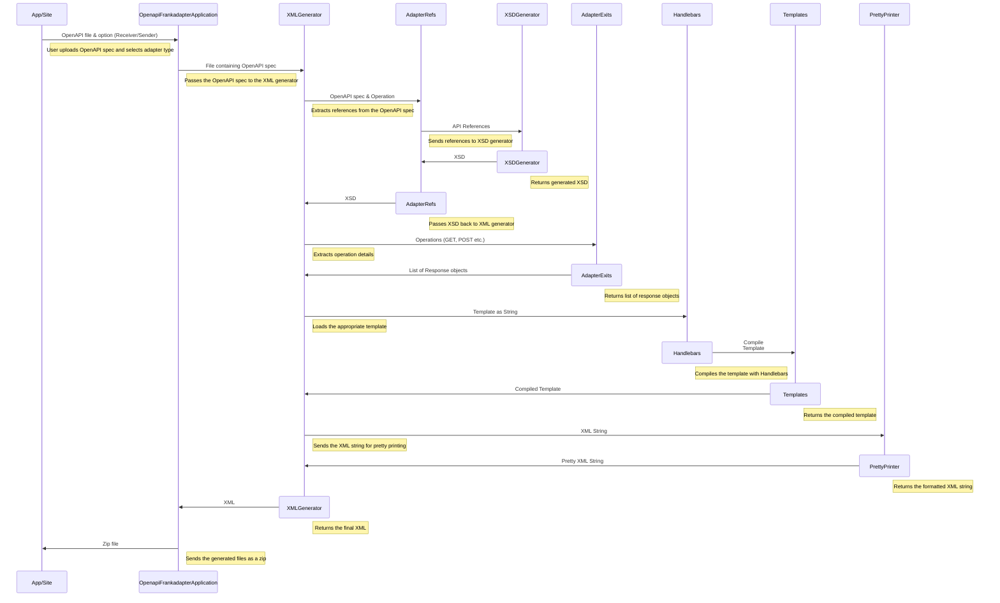

# OpenAPI2Frank Adapter
This project will allow you to convert your OpenAPI endpoints to Frank!Adapter configurations.
These adapters can be implemented in your Frank!Framework to gain insight and test your specific endpoints.

You can use this generator by uploading a file or entering a url of an OpenAPI specification in either JSON or YAML and pressing
on the button of the desired type of adapter.

# Contents
- [Installation and Running](#installation-and-running)
- [Sequence Diagram](#sequence-diagram)

# Installation and Running
## Cloning
To clone the OpenAPI2Frank Adapter, make sure you are in your preferred directory and run the following command:

```sh
git clone https://github.com/wearefrank/openapi-frank-generator
```

## Running

### Local
To start the application, you can simply run the Spring Boot file [OpenapiFrankadapterApplication.java](src/main/java/nl/wearefrank/openapifrankadapter/OpenapiFrankadapterApplication.java).

The application has finished starting up when you see this message:
```
Started OpenapiFrankadapterApplication in X seconds (process running for Y)
```

### Docker
You can also run the OpenAPI Adapter in a Docker container.
To build the Docker image, run the following command in the root of the project:

```sh
docker build -t openapi-frank-generator .
```

To run the container, run the following command:

```sh
docker run -p 8080:8080 openapi-frank-generator
```

### Accessing the application

For both instances, you can access the application at:

http://localhost:8080

## Online

An online instance of this project can be found at:

https://openapi-frank-generator.wearefrank.org/

# API
The online instance of this project can also be accessed through an API.\
To use this API, you can send a POST request to the following endpoint:
```
https://openapi-frank-generator.wearefrank.org/{option}-{file/url}

Ex: https://openapi-frank-generator.wearefrank.org/receiver-file
```

# Sequence Diagram


