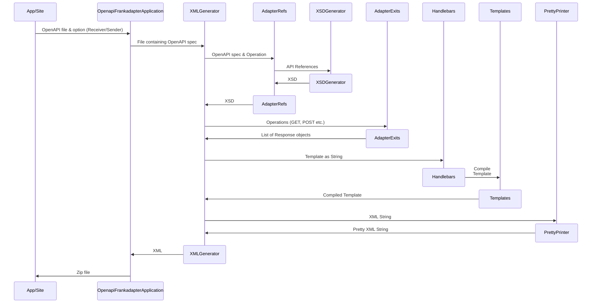

# OpenAPI2Frank Adapter
This project will allow you to convert an OpenAPI file or url to a WeAreFrank! Adapter.

# Contents

- [Installation](#installation)
- [Instances](#instances)
- [Sequence Diagram](#sequence-diagram)

# Installation
## Clone the OpenAPI Adapter
Clone this project into your preferred folder.

```
git clone https://github.com/wearefrank/openapi-frank-generator
```

You can now run the OpenAPI Adapter on your own machine.

The application has finished starting up when you see this message:
```bash
Started OpenapiFrankadapterApplication in 2.802 seconds (process running for 3.992)
```

You can now connect to the following address:

http://localhost:8080

## Online

An online instance of this project can be found at:

https://openapi-frank-generator.wearefrank.org/


# Sequence Diagram


